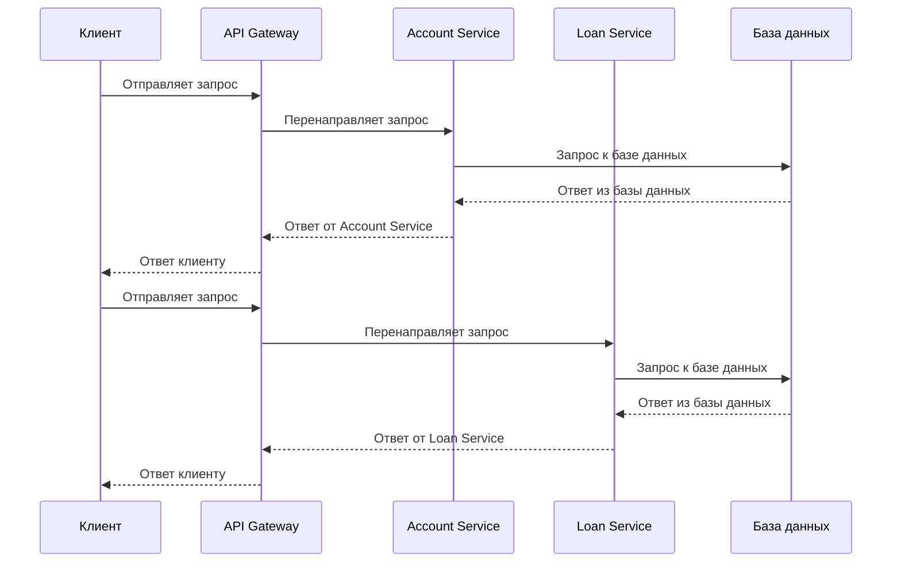

# Модуль 6: **Observability (Наблюдаемость)**

## **Цель модуля**

Понять, что такое **observability** в контексте инфраструктуры и приложений, какие компоненты она включает, и как Terraform может помочь в настройке инструментов для наблюдаемости и мониторинга. Мы рассмотрим основные концепции наблюдаемости, инструменты, такие как **Prometheus**, **Grafana**, **Elastic Stack**, и научимся интегрировать их с Terraform для автоматизации развертывания и конфигурации.

### 1. **Что такое Observability?**

**Observability** (наблюдаемость) — это способность системы предоставлять информацию о своем внутреннем состоянии через экспозицию данных, которые можно собирать и анализировать. В отличие от мониторинга, который фокусируется на отслеживании состояния системы в реальном времени, наблюдаемость охватывает гораздо более широкий спектр данных, таких как **метрики**, **логи** и **трейсы**, которые помогают не только выявить проблемы, но и диагностировать их причины.

#### 1.1. **Основные компоненты Observability**:

Observability включает в себя три ключевых компонента:

* **Метрики (Metrics)**:

  * Это числовые показатели, такие как загрузка процессора, использование памяти, сетевой трафик и другие параметры, которые могут помочь отслеживать производительность системы.
* **Логи (Logs)**:

  * Логи — это текстовые записи, которые создаются различными сервисами и приложениями. Логи содержат информацию о событиях, которые происходят в системе, и могут помочь при диагностике сбоев.
* **Трейсы (Traces)**:

  * Трейсы отслеживают выполнение запросов через распределенную систему, показывая, какие компоненты системы были вовлечены и сколько времени заняли операции.

### 2. **Почему Observability важна?**

Observability критически важна для обеспечения стабильности и производительности систем, особенно в условиях микросервисной архитектуры и распределенных систем. Он позволяет:

* **Раннее выявление проблем**: Быстро реагировать на аномалии и отклонения в производительности.
* **Диагностика и устранение проблем**: Логирование и трейсы позволяют точно понять, где происходит сбой или замедление.
* **Улучшение производительности**: Системы с высокой наблюдаемостью позволяют лучше оптимизировать ресурсы и предотвратить деградацию.

### 3. **Как Terraform может помочь в настройке Observability?**

Terraform может помочь в автоматизации и упрощении процесса развертывания инструментов для **observability**. Вместо ручной настройки мониторинга и инструментов для сбора метрик, логов и трассировок, Terraform позволяет описать всю инфраструктуру как код, включая компоненты наблюдаемости.

#### 3.1. **Инструменты для Observability, которые можно настроить через Terraform**

1. **Prometheus**:

   * Это система мониторинга и алёртинга, которая собирает метрики и временные ряды. Prometheus идеально подходит для мониторинга микросервисов и приложений.
2. **Grafana**:

   * Grafana — это инструмент для визуализации данных, собранных Prometheus, ElasticSearch или других источников данных. Grafana позволяет строить дашборды и отображать метрики.
3. **Elastic Stack (ELK)**:

   * **Elasticsearch**, **Logstash**, и **Kibana** — это набор инструментов для обработки и анализа логов. Они позволяют собирать, индексировать, искать и визуализировать данные из разных источников.
4. **Jaeger** или **Zipkin**:

   * Эти системы предназначены для распределённого трекинга запросов. Они позволяют отслеживать путь запроса через все сервисы в распределенной системе.

#### 3.2. **Пример настройки Prometheus с Terraform**

Для того чтобы настроить Prometheus с помощью Terraform, можно использовать Docker или облачные решения, такие как AWS или GCP.

Пример конфигурации для создания контейнера Prometheus с использованием Terraform и Docker:

```hcl
provider "docker" {}

resource "docker_network" "monitoring_network" {
  name = "monitoring_network"
}

resource "docker_container" "prometheus" {
  image = "prom/prometheus:latest"
  name  = "prometheus"
  ports {
    internal = 9090
    external = 9090
  }
  networks_advanced {
    name = docker_network.monitoring_network.name
  }
  volumes {
    host_path      = "./prometheus.yml"
    container_path = "/etc/prometheus/prometheus.yml"
  }
  restart = "unless-stopped"
}
```

В данном примере мы создаем контейнер с **Prometheus** с помощью Terraform и Docker, настраиваем сеть и монтируем конфигурационный файл для сбора метрик.

#### 3.3. **Пример настройки Grafana с Terraform**

Настроим **Grafana** для визуализации метрик, собранных Prometheus, используя Terraform:

```hcl
resource "docker_container" "grafana" {
  image = "grafana/grafana:latest"
  name  = "grafana"
  ports {
    internal = 3000
    external = 3000
  }
  networks_advanced {
    name = docker_network.monitoring_network.name
  }
  environment = {
    GF_SECURITY_ADMIN_PASSWORD = "admin"
  }
  restart = "unless-stopped"
}
```

Этот код развертывает **Grafana** с базовыми настройками для доступа через веб-интерфейс по порту 3000.

#### 3.4. **Интеграция с Elastic Stack (ELK)**

Если вы хотите настроить сбор логов с помощью **Elasticsearch**, **Logstash** и **Kibana**, это также можно автоматизировать с помощью Terraform. Пример конфигурации для развертывания **Elasticsearch** в Docker:

```hcl
resource "docker_container" "elasticsearch" {
  image = "docker.elastic.co/elasticsearch/elasticsearch:7.10.1"
  name  = "elasticsearch"
  ports {
    internal = 9200
    external = 9200
  }
  restart = "unless-stopped"
}
```

После этого вы можете настроить **Kibana** для визуализации логов и данных из Elasticsearch.

### 4. **Как Terraform помогает в автоматизации Observability?**

**Terraform** помогает автоматизировать не только создание инфраструктуры, но и её мониторинг. С Terraform вы можете:

* **Автоматизировать развертывание всех компонентов observability**: включая Prometheus, Grafana, Jaeger и другие инструменты.
* **Интегрировать их с другими сервисами и приложениями**: Например, можно настроить мониторинг EC2-инстансов в AWS или виртуальных машин в Azure.
* **Обеспечить консистентность и повторяемость**: Вы всегда можете повторно развернуть весь стек мониторинга с одинаковыми настройками, минимизируя возможность ошибок.
* **Легко масштабировать и обновлять компоненты**: Например, можно быстро добавить новые метрики, обновить конфигурацию мониторинга или масштабировать компоненты на основе новых требований.

### 5. **Применение Observability в процессе CI/CD**

Terraform можно интегрировать с процессами CI/CD для того, чтобы автоматически развертывать и обновлять решения для наблюдаемости в ответ на изменения в коде инфраструктуры.

* **Обновление конфигурации**: При изменении приложений или сервисов, Terraform автоматически обновляет соответствующие конфигурации мониторинга.
* **Автоматические алёрты**: Создание алёртов через Terraform помогает оперативно уведомлять команду о любых сбоях или отклонениях.

### Заключение

**Observability** — это основная концепция для обеспечения стабильности и эффективности в управлении современными инфраструктурами и приложениями. Terraform предоставляет мощные возможности для автоматизации развертывания и настройки инструментов для наблюдаемости, таких как **Prometheus**, **Grafana**, **Elasticsearch** и других. Интеграция этих инструментов с Terraform помогает обеспечить более высокую стабильность, быструю диагностику и управление состоянием инфраструктуры в масштабируемых и распределённых системах.


## 📊 Диаграмма последовательности (Mermaid)



*Пояснение диаграммы:*

* **Клиент** отправляет запросы к **API Gateway**.
* **API Gateway** маршрутизирует запросы к соответствующим микросервисам (**Account Service** или **Loan Service**).
* Микросервисы взаимодействуют с соответствующими базами данных для получения или обновления данных.
* Ответы от микросервисов возвращаются через **API Gateway** клиенту.
